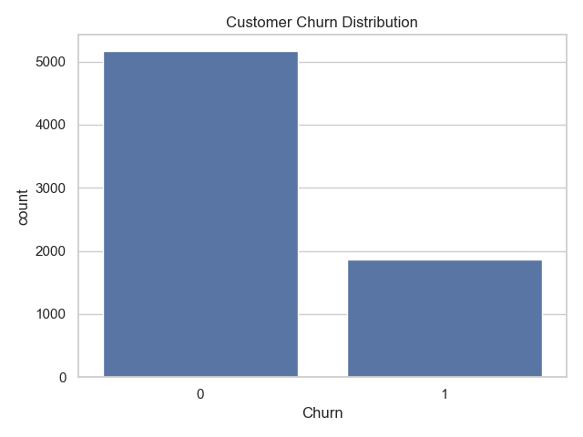
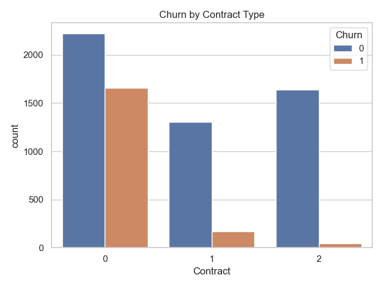
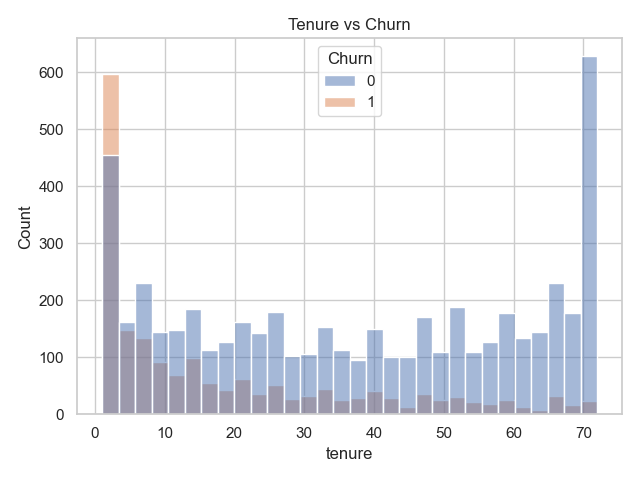
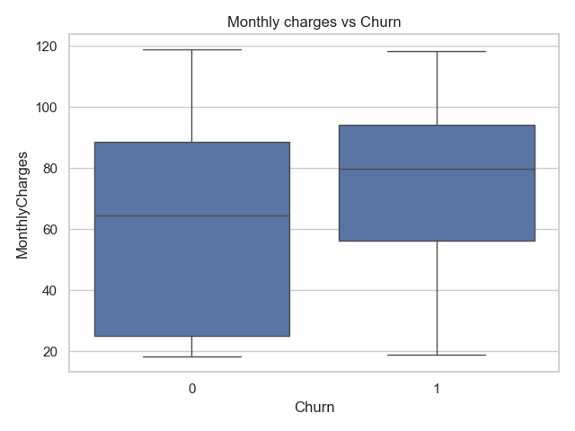
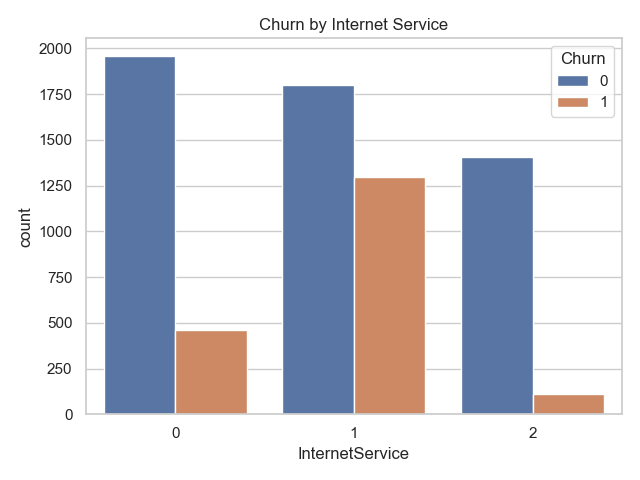

# 📊 Customer Churn Analysis & Prediction

## 📌 Problem Statement

Customer churn is a major challenge for subscription-based businesses. This project analyzes customer data to identify key factors influencing churn and builds a machine learning model to predict customer churn.

---

## 🎯 Objectives

* Analyze customer behavior and identify churn patterns
* Discover key factors affecting customer retention
* Build a predictive model to identify high-risk customers

---

## 🛠️ Tools & Technologies

* Python (Pandas, NumPy)
* Data Visualization (Matplotlib, Seaborn)
* Machine Learning (Scikit-learn)
* Jupyter Notebook

---

## 📂 Dataset

* Telco Customer Churn Dataset

---

## 🧹 Data Cleaning

* Converted `TotalCharges` from object to numeric
* Handled missing values
* Removed unnecessary column (`customerID`)

---

## 📊 Exploratory Data Analysis (EDA)

### 🔹 Key Insights

* 📉 ~27% customers churned (≈ 1 in 4 customers)
* 📆 Month-to-month contract customers have the highest churn
* ⏳ New customers (low tenure) are more likely to leave
* 💰 Higher monthly charges increase churn probability
* 🌐 Fiber optic users show higher churn behavior

---

## 📸 Visualizations

### Churn Distribution

### Contract vs Churn

### Tenure vs Churn

### Monthly Charges vs Churn

### Internet Service vs Churn

---

## 🤖 Machine Learning Model

* Model Used: Logistic Regression
* Accuracy: **~78.5%**

### 📊 Model Performance

* Performs well for non-churn customers
* Lower accuracy in predicting churn customers due to class imbalance

---

## 📈 Model Evaluation

* Accuracy: ~78.5%
* Confusion Matrix shows model predicts majority class better
* Indicates need for improving churn prediction

---

## 💡 Business Recommendations

* Offer discounts for long-term contracts
* Improve onboarding experience for new customers
* Provide better pricing/value for high-paying users
* Improve service quality for fiber users

---

## 🚀 Future Improvements

* Apply advanced models (Random Forest, XGBoost)
* Handle class imbalance (SMOTE / class weighting)
* Build interactive dashboard (Power BI / Streamlit)

---

## 🏁 Conclusion

This project demonstrates how data analysis and machine learning can help businesses reduce customer churn by identifying key risk factors and enabling proactive retention strategies.

---

## 👨‍💻 Author

**Abhishek Kumar Singh**
